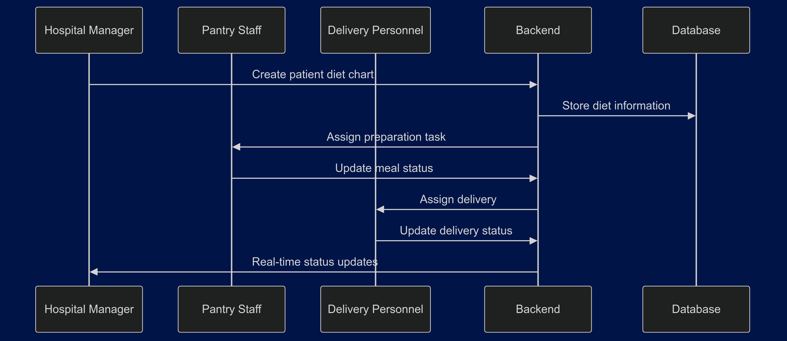

# Hospital Food Delivery Management System

## Overview

A comprehensive system for managing hospital food preparation and delivery workflows. The platform connects hospital managers, pantry staff, and delivery personnel through a unified dashboard for efficient meal management and delivery tracking.

## Features

- Role-based authentication with JWT
- Patient and diet chart management
- Real-time delivery tracking
- Task assignment and monitoring
- Status updates for meal preparation and delivery
- Analytics dashboard for performance metrics

## Development Roadmap


## System Architecture


## Data Flow



## Workflow States


## Deployment Architecture


## Installation

```bash
# Clone repository
git clone https://github.com/geekobueno/hospital-food-delivery-management.git

# Install dependencies
pnpm install

# Configure environment
cp .env.example .env

# Start development server
pnpm run start:dev
```

## Contributing

1. Fork the repository
2. Create feature branch
3. Commit changes
4. Push to branch
5. Create Pull Request
